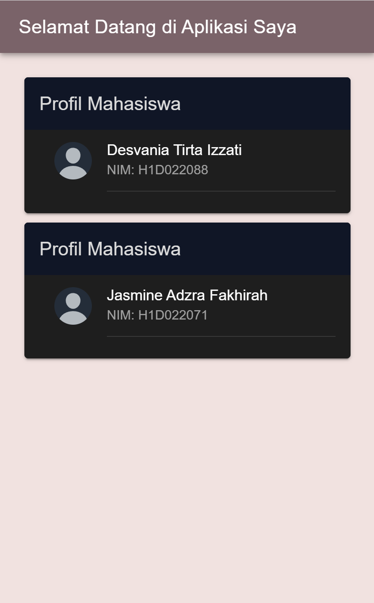

untuk menambahkan element tool bar pada bagian <ion-header> menggunakan <ion-toolbar> yang di dalamnya terdapat <ion-title> untuk menulis judulnya.
<ion-header>    
  <ion-toolbar>
    <ion-title>Selamat Datang di Aplikasi Saya</ion-title>
  </ion-toolbar>
</ion-header>

Tag <ion-card> untuk menambahkan elemen Card.
<ion-card>
...
</ion-card>
caranya, tag <ion-card> akan di letakkan di dalam tag <ion-content>.

Kemudian untuk cardnya terdapat 2 bagian, yaitu ion-card-header dan ion-card-element.
Untuk headernya berisi Judul dari masing-masing Card.
<ion-card-header>
      <ion-card-title>Profil Mahasiswa</ion-card-title>
</ion-card-header>
Untuk elementnya berisi Icon(avatar default dari ionic), Nama, dan NIM.:
<ion-card-content>
      <ion-item>
        <ion-avatar slot="start">
          
        </ion-avatar>
        <ion-label>
          <h2>Desvania Tirta Izzati</h2>
          
NIM: H1D022088

        </ion-label>
      </ion-item>
      

    </ion-card-content>

